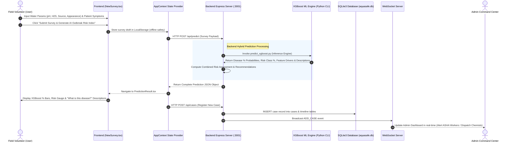

# AquaSafe AI - Outbreak Prevention & Water Security System

AquaSafe AI is an advanced, real-time epidemiological biosurveillance and water quality assessment platform designed for municipal and public health command centers. The system enables field workers (volunteers) to log door-to-door water quality assessments and clinical symptoms, automatically predicting waterborne contamination vectors and potential outbreak risks using a **Hybrid AI Architecture**: Google Gemini 2.5 Flash, an **XGBoost Machine Learning Classifier Engine**, and a deterministic rule-based fallback system.

> 📖 **Full Tech Stack & Architecture Document**: For detailed documentation on machine learning algorithms, dataset preprocessing, feature engineering, and fallback hierarchy, see [TECH_STACK_AND_ARCHITECTURE.md](TECH_STACK_AND_ARCHITECTURE.md).

---

## 🛠️ Tech Stack

### Frontend (User Interface)
* **Core:** React (v19) / TypeScript
* **Build System:** Vite
* **Styling:** Tailwind CSS (v4) / Space Grotesk & Inter Typography
* **Animations:** Motion (Framer Motion)
* **Icons & Charts:** Lucide React & Recharts

### Backend (Server & Database)
* **Runtime:** Node.js (ES Modules) & Python 3.10
* **Framework:** Express
* **Database:** SQLite3 (`sqlite` wrapper for async queries) - Stores volunteers, case registries, and audit logs.
* **Real-time Synchronization:** WebSocket Server (`ws`) - Instantly broadcasts newly registered cases and actions to all active admin and volunteer dashboards.

### AI/ML Prediction Models
* **XGBoost ML Engine:** `xgb.XGBClassifier` trained on water parameters and clinical symptom vectors, returning percentage match probabilities, risk class distributions, and feature importance drivers.
* **Disease Description Engine:** Automatically loads and attaches clear, user-friendly medical explanations from `ml/datasets/symptom_Description.csv` and `backend/data/diseases.json`.
* **GenAI Engine:** Google `@google/genai` SDK (`gemini-2.5-flash` model).
* **Deterministic Fallback Engine:** Custom Jaccard-weighted rule inference module matching inputs against a 20-disease profile database.

---

## 🔄 End-to-End Project Flow (Frontend to Backend)


The diagram below details the complete execution flow when a field volunteer conducts a water quality & clinical survey:



---

## 🏗️ System Architecture & Full Technical Blueprint


The AquaSafe AI platform uses a decoupled, layered client-server architecture with persistent local storage, real-time communication sockets, and a hybrid AI prediction gateway.

```mermaid
graph TD
    subgraph Client Layer (React / Vite)
        UI[Vite Single Page App]
        Context[AppContext State Provider]
        WSClient[WebSocket client-side Listener]
        UI --> Context
        Context --> UI
        Context <--> WSClient
    end

    subgraph Communication Layer (HTTP & WebSockets)
        API[Express REST API]
        WSS[WebSocket Server Client Broadcaster]
    end

    subgraph Application & Business Logic (Node.js & Python ML)
        Auth[Crypto SHA-256 Authentication]
        Sync[Database Sync Handler]
        
        subgraph Hybrid Prediction Core
            Decider{GEMINI_API_KEY Configured?}
            GeminiClient[Google GenAI Client SDK]
            XGBEngine[XGBoost ML Classifier Engine]
            RuleEngine[Weighted Local Inference Engine]
            DiseasesDB[(diseases.json DB & symptom_Description.csv)]
        end
    end

    subgraph Data Store Layer (SQLite3 & Trained ML Models)
        DB[(sqlite3 Database)]
        MLModels[(xgboost_disease_model.json & feature_schema.json)]
    end

    %% Client Communication flows
    Context -->|HTTP POST /api/predict| API
    Context -->|HTTP POST /api/login| API
    WSClient <-->|ws-app WebSocket connection| WSS

    %% API to logic mappings
    API --> Auth
    API --> Decider
    Decider -->|Yes| GeminiClient
    API --> XGBEngine
    XGBEngine --> MLModels
    XGBEngine --> DiseasesDB
    Decider -->|No / Error Fallback| RuleEngine
    RuleEngine --> DiseasesDB

    %% WSS & Backend to DB interactions
    WSS <--> Sync
    Sync <--> DB
    API --> DB
```

---

## 🌟 Key Features & Architectural Enhancements

### 1. XGBoost Machine Learning Percentage Evaluation Engine
* Incorporates trained XGBoost Classifier models (`xgb.XGBClassifier`) evaluating:
  - **Disease Probability Percentages**: Multi-class percentage confidence for Cholera, Typhoid, Acute Gastroenteritis, Dysentery, Fluorosis, Lead Toxicity, etc.
  - **Risk Class Probabilities**: Exact percentage breakdown (`Safe %`, `Contaminated %`, `Highly Contaminated %`).
  - **Feature Importance Drivers**: XGBoost split weight scores showing which water parameters (pH, H₂S test) and clinical symptoms contributed most to the prediction.

### 2. Medical Disease Description System
* Every disease returned by the prediction engine comes with a clear, user-friendly medical explanation loaded from `ml/datasets/symptom_Description.csv` and `backend/data/diseases.json`.
* Includes interactive **"What is this disease?"** expandable callout cards on the survey result screen and case dossiers.

### 3. Unified Fixed-Height Viewport Layout
* The entire application is constrained to the viewport height (`h-screen`). 
* The **Sidebar** is locked to `h-[calc(100vh-64px)]` and `overflow-hidden` to prevent page-level browser scroll bars.
* All dashboard content panels scroll internally using standard `overflow-y-auto` panels.

### 4. Real-time Database Synchronization
* Backed by a persistent SQLite database (`aquasafe.db`).
* When a case is updated by an admin (e.g., dispatching ASHA workers or resolving a case), updates are pushed via WebSockets to instantly update all active volunteer screens without reloading.

---

## 🚀 Setup & Startup

### One-Click Startup (Recommended for Windows)
Simply double-click **`start_aquasafe.bat`** (or **`start.bat`**) in the root directory, or run in terminal:

```cmd
.\start.bat
```

This will automatically launch:
* **Backend Express Server** on `http://localhost:3001`
* **Frontend React Dashboard** on `http://localhost:3000`

---

### Manual Setup & Execution

#### Prerequisites
* Node.js (v18.0.0 or higher)
* Python (v3.10.0 or higher with `xgboost`, `pandas`, `scikit-learn`)

#### Step 1: Train/Verify XGBoost Models
```bash
python ml/train_xgboost.py
```

#### Step 2: Start the Backend Server
```bash
cd backend
npm install
npm run dev
```

#### Step 3: Start the Frontend Application
```bash
cd frontend
npm install
npm run dev
```

---

## 🔑 Default Credentials

| Role | Username | Password |
| :--- | :--- | :--- |
| **Admin** | `admin` | `admin@123` |
| **Volunteer** | `Anil_Kumar` | `demo1234` |
| **Volunteer** | `Meera_Deshmukh` | `demo1234` |
